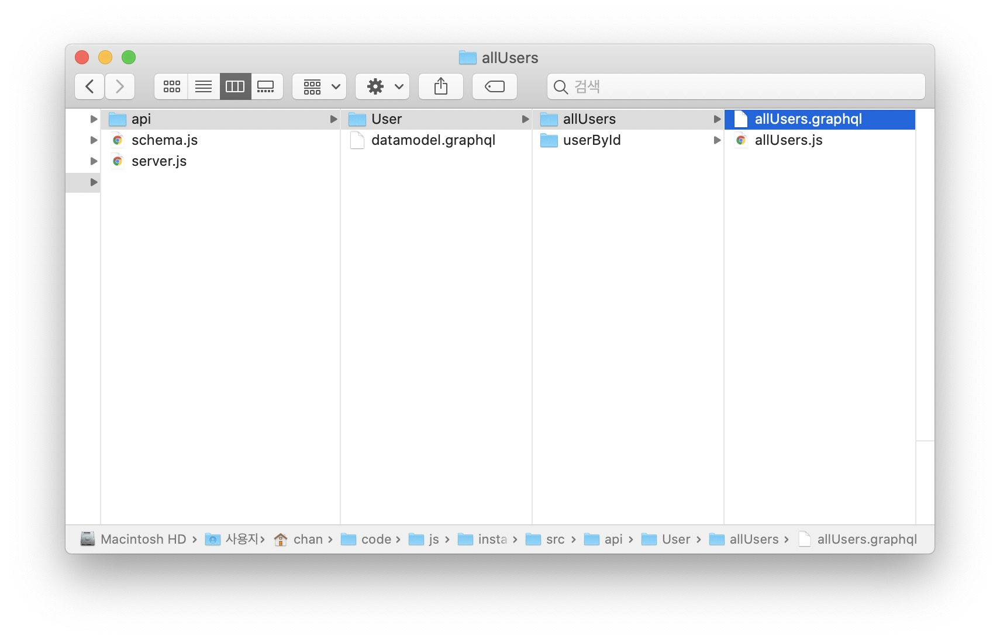

# Basic Prisma

## Setup

Sign up Prisma and follow the guideline, making the new service from account

```js
// .gitignore
generated; // prisma files
prisma.yml; // the files that have private server information
```

```json
"scripts": {
    "deploy": "prisma deploy",
    "generate": "prisma generate",
    "prisma": "yarn run deploy && yarn run generate",
    "dev": "nodemon --exec babel-node src/server.js"
  }
```

## Prisma Introduction

- `id: ID! @id` : Must add this code at each type
- `@unique` `@unique` : This mean this is **unique**
- `userName: String!` `bio: String` : **String!** is necessary **String** is unnecessary
- `@default(value: "")` : Set default value
- `@relation(name: "FollowRelation")` : Set each other's relation

In this case, If you add **B** to followers of **A**,
automatically **A** is added to following of **B**.

```graphql
type User {
  id: ID! @id
  userName: String! @unique
  email: String! @unique
  firstName: String @default(value: "")
  lastName: String
  bio: String
  posts: [Post!]!
  likes: [Like!]!
  comments: [Comment!]!
  followers: [User!]! @relation(name: "FollowRelation")
  following: [User!]! @relation(name: "FollowRelation")
  rooms: [Room!]!
}
```

## Intergrating Prisma in Server with graphql

### There is no tool to connect datamodel between prisma and graphql

### So, if you want add new datamodel, you must add new model to Prisma and copy/paste to graphql

### File Structure



### Data Model

`datamodel.graphql` must not have prisma gramer like `@id`. Graphql didn't support.

```graphql
type User {
  id: ID!
  userName: String!
  email: String!
  firstName: String
  lastName: String
  bio: String
  posts: [Post!]!
  likes: [Like!]!
  comments: [Comment!]!
  followers: [User!]!
  following: [User!]!
  rooms: [Room!]!
}
```

## Using Prisma from graphql resolver

```js
import { prisma } from "../../../../generated/prisma-client";
export default {
  Query: {
    allUsers: () => prisma.users()
  }
};
```

## \$fragment() for prevent error

Prisma deny the request like this

```graphql
{
  allUsers {
    id
    posts {
      id
    }
  }
}
```

Because this request can be changed like this to attack server

```graphql
{
  allUsers{
    id
    posts {
      id
      user {
          id
          posts {
              id
              user {
                  ....
              }
          }
      }
    }
  }
}
```

### To use request what have 'posts', Use `.$fragment()`

```js
import { prisma } from "../../../../generated/prisma-client";
export default {
  Query: {
    userById: async (_, args) => {
      const { id } = args;
      return await prisma.user({ id }).$fragment();
    }
  }
};
```
